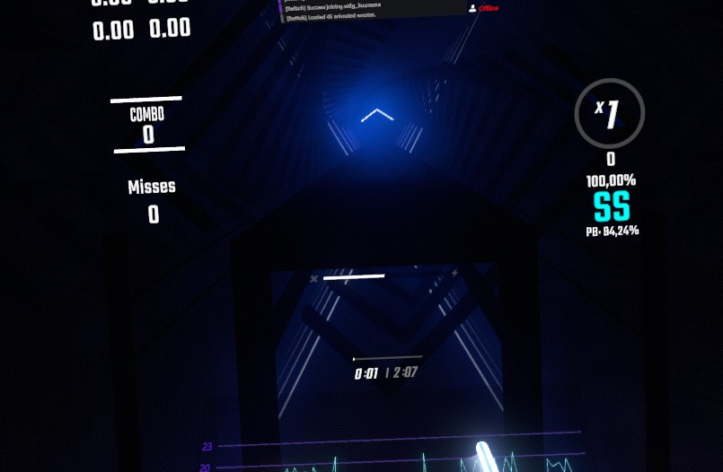
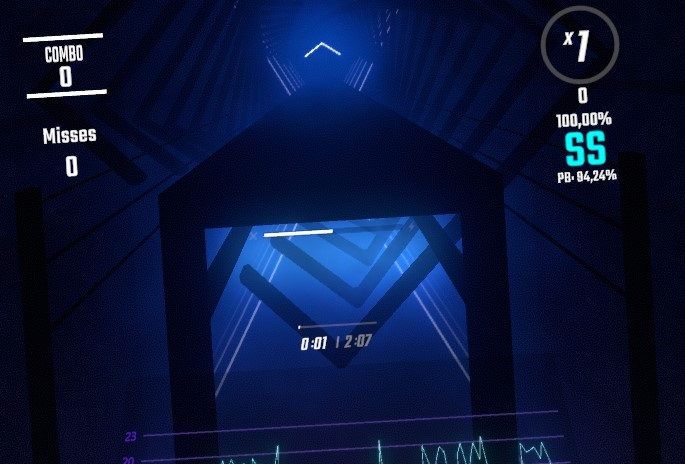
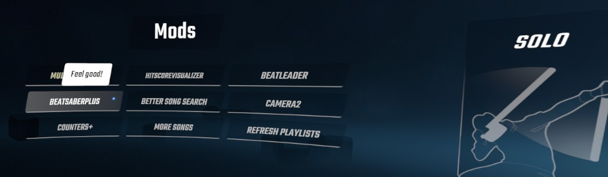
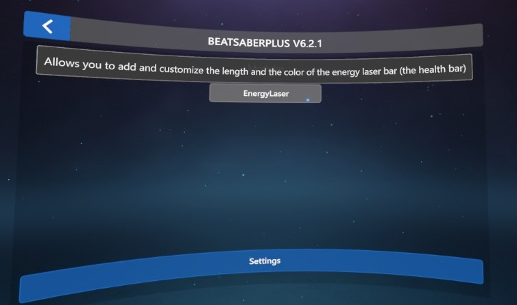
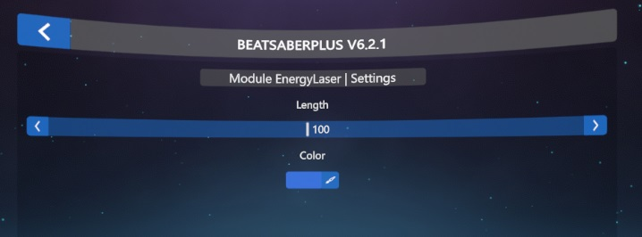

# EnergyLaser (BeatSaberPlus module)

EnergyLaser is a BSPlus module that allows you to add and customize the length and color around the energy laser bar (the health bar)

- [How to install](#how-to-install)
- [Look](#look)
- [Enable/Configuration](#enable-configuration)

# How to install

- Install **BSIPA** dependency using [ModAssistant](https://github.com/Assistant/ModAssistant)

- Install **ChatPlexSDK_BS** (The BSPlus SDK) from [Here](https://github.com/hardcpp/BeatSaberPlus/releases) (or from their discord) -> Download and open the zip file that correspond to your game version and put the necessary `ChatPlexSDK_BS.dll` from the plugins folder in the `/plugins` directory that's inside your game folder

- Download the latest file for your game version from the [Releases page](https://github.com/Kuurama/BeatSaberPlus_EnergyLaser/releases) and put the inside folders in the root of your game folder

# Look

Here is how the game might look like before enabling the mod:

And this is how it looks with the module enabled (with the default module config):

# Enable-Configuration

To configure the mod, open the BeatSaberPlus Settings: 
Then, enable it here if not already (Using the Settings button at the bottom) (That's also how you disable it): 

And now, tweak the settings as you like them to from here. 
